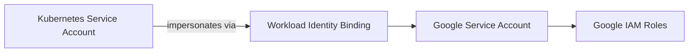

# Security Module

## Purpose

The `security` OpenTofu module creates a reusable Google Service Account, assigns IAM roles, and configures Workload Identity binding to a Kubernetes Service Account.

## Architecture Diagram



## Workload Identity Flow

1. The module creates a Google Service Account (GSA) in the target GCP project.
2. It assigns one or more IAM roles to the GSA.
3. It grants the Kubernetes Service Account (KSA) the `roles/iam.workloadIdentityUser` permission on the GSA.
4. The KSA can then impersonate the GSA when running workloads on GKE.

## IAM Role Strategy

- Use least privilege by assigning only the roles required for the workload.
- Keep role assignment externalized in the calling blueprint or environment-specific configuration.
- Do not hardcode environment-specific or project-specific IAM roles inside the module.

## Example Usage

```hcl
module "security" {
  source = "../../modules/security"

  project_id                 = "clusterforge-dev"
  service_account_name       = "argocd"
  service_account_display_name = "ArgoCD Service Account"
  kubernetes_namespace       = "argocd"
  kubernetes_service_account = "argocd-server"

  roles = [
    "roles/container.viewer",
    "roles/artifactregistry.reader",
    "roles/secretmanager.secretAccessor",
  ]
}
```

## Future Integration with GKE Module

- The GKE module can consume `service_account_email` and `service_account_name` outputs.
- Downstream modules can use this module to centralize identity and access management.
- Future enhancements may include optional workload-specific role sets and automated KSA creation.
